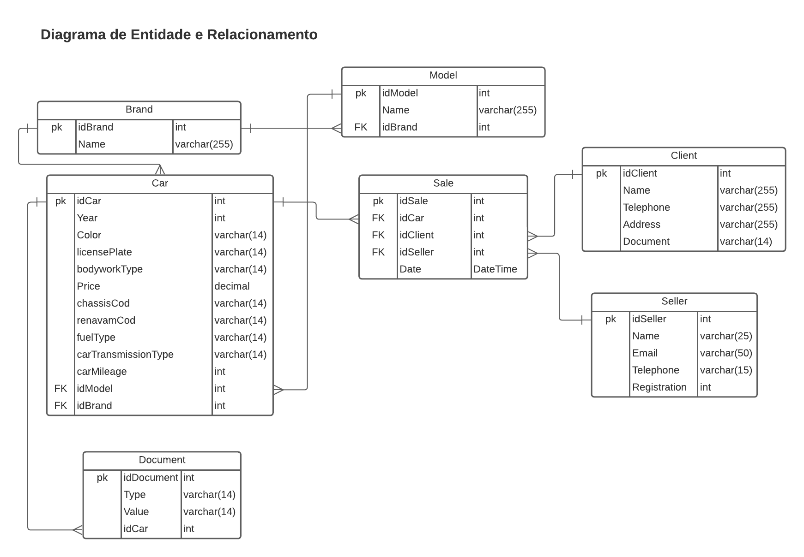
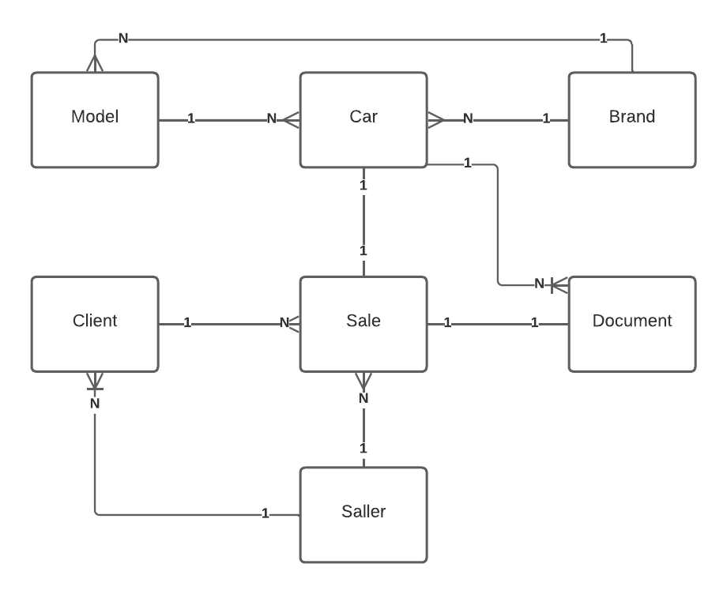
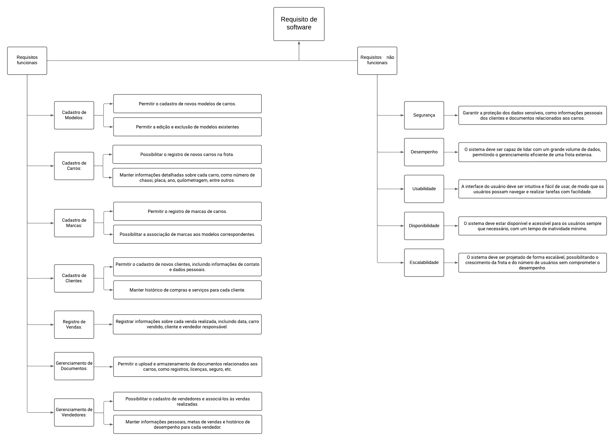
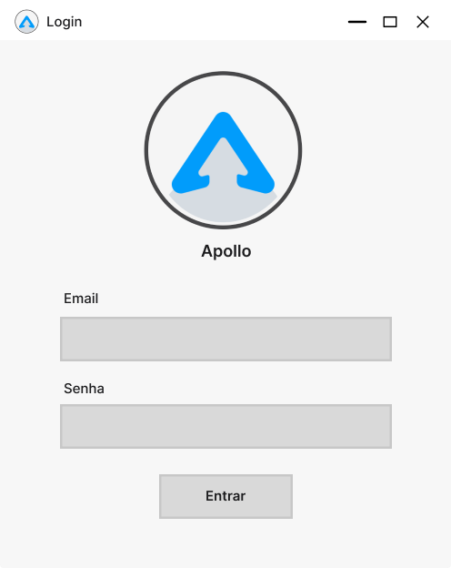
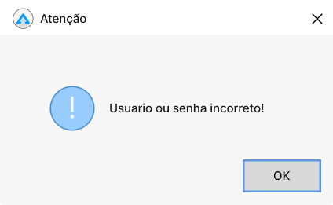
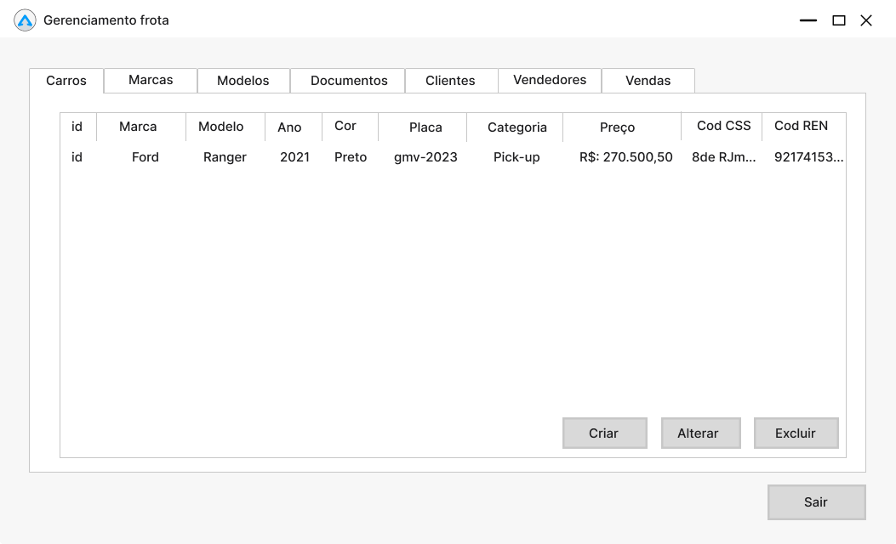
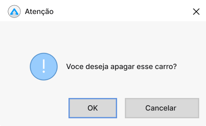
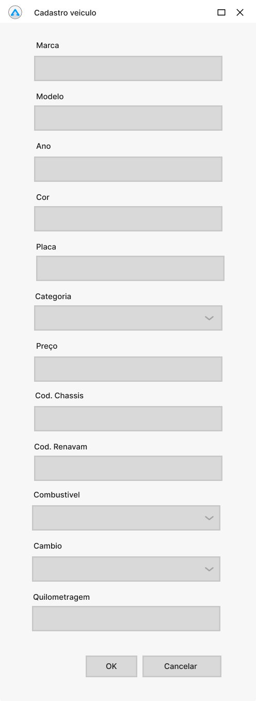
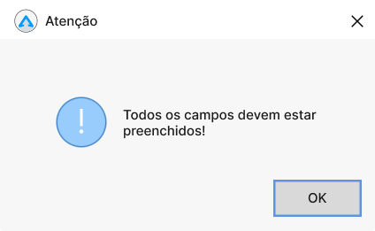
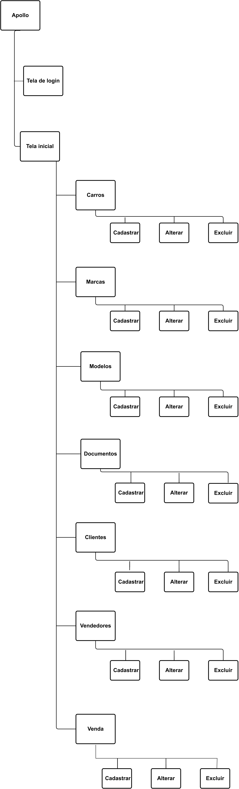

# Documentação Técnica - Apollo Fleet Management

Neste documento, você encontrará informações essenciais sobre o projeto, incluindo o Diagrama de Entidade e Relacionamento (D.E.R), o Modelo de Entidade e Relacionamento (M.E.R), os requisitos funcionais, os requisitos não funcionais, os protótipos de tela e o fluxo de telas.

## DER - Diagrama de Entidade e Relacionamento

O D.E.R é uma representação visual das entidades presentes no sistema e suas relações. Ele fornece uma visão clara da estrutura do banco de dados e das conexões entre os diferentes elementos.

**Observação:**
Este documento utiliza nomes em inglês para as entidades e elementos, a fim de manter o projeto padronizado. Essa escolha baseia-se no fato de que as nomenclaturas em inglês promovem consistência, clareza e seguem uma terminologia técnica padronizada.

## MER - Modelo Entidade Relacionamento

M.E.R, por sua vez, é um modelo detalhado que descreve as entidades, seus atributos e os relacionamentos entre elas. Ele permite uma compreensão aprofundada do sistema e serve como base para o desenvolvimento do software.

**Observação:**
Este documento utiliza nomes em inglês para as entidades e elementos, a fim de manter o projeto padronizado. Essa escolha baseia-se no fato de que as nomenclaturas em inglês promovem consistência, clareza e seguem uma terminologia técnica padronizada.

## Requisitos do Software

Os requisitos de software são categorizados em dois grupos principais: requisitos funcionais e requisitos não funcionais. Os requisitos funcionais descrevem as funcionalidades detalhadas que o software deve oferecer, especificando as ações que o sistema deve realizar e os resultados esperados. Por outro lado, os requisitos não funcionais abordam aspectos importantes para a qualidade e desempenho global do software, como desempenho, segurança, usabilidade e escalabilidade. Ambos os tipos de requisitos são essenciais para garantir um software de alta qualidade e eficácia, atendendo às necessidades e expectativas dos usuários.

## Prototipagem de tela

Além disso, este documento apresenta os protótipos de tela, que são representações visuais das interfaces do usuário. Eles mostram como as informações serão apresentadas e como os usuários interagirão com o sistema.

### Tela de Login

### Avisos de login

### Tela principal

### Avisos de exclusão de itens

### Tela cadastro de item

### Avisos de cadastro de itens

### Tela alteração de item

### Avisos de alteração de itens

**Observação:**
Neste documento, foi optado por incluir apenas as telas específicas de cadastrar carro, alterar carro, deletar carro e listar carro como representações exemplares das demais telas do sistema. Essas telas selecionadas possuem elementos e características similares às outras telas, tornando-as representativas do conjunto completo de telas do software.

### Fluxo principal de tela

Por fim, o fluxo de telas descreve a sequência de interações entre as diferentes telas do software. Ele demonstra como os usuários navegarão pelo sistema e como as telas se relacionam umas com as outras.

